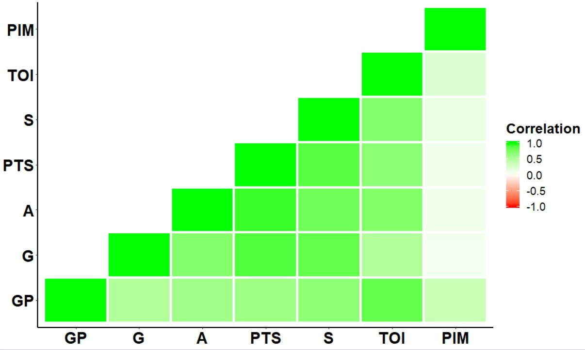
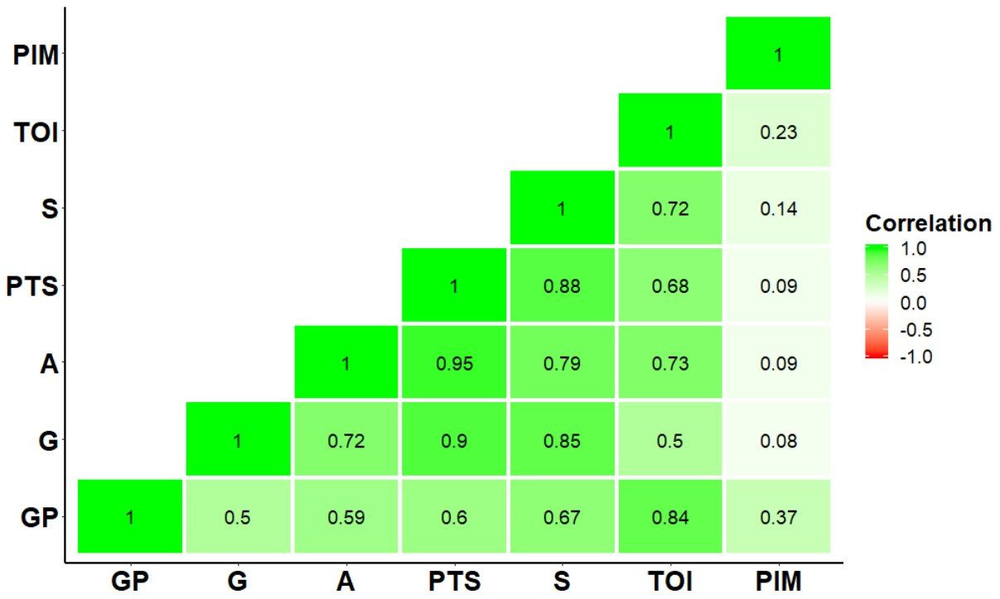
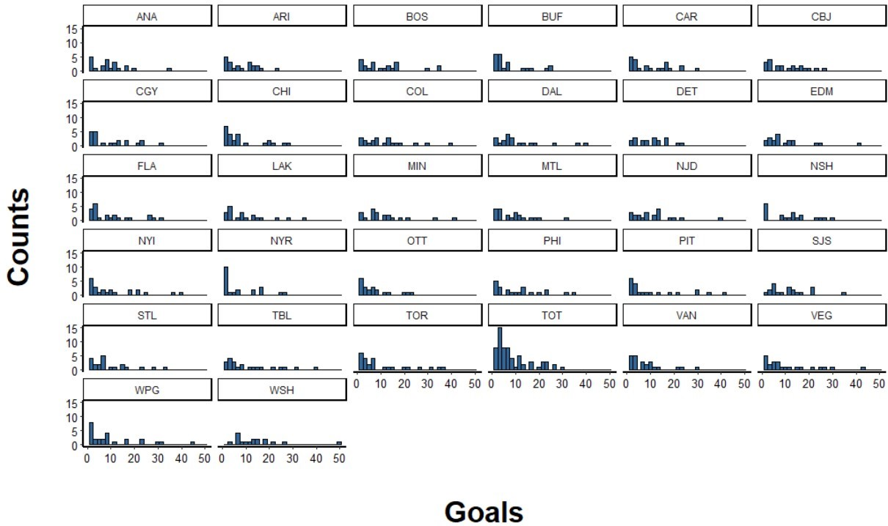
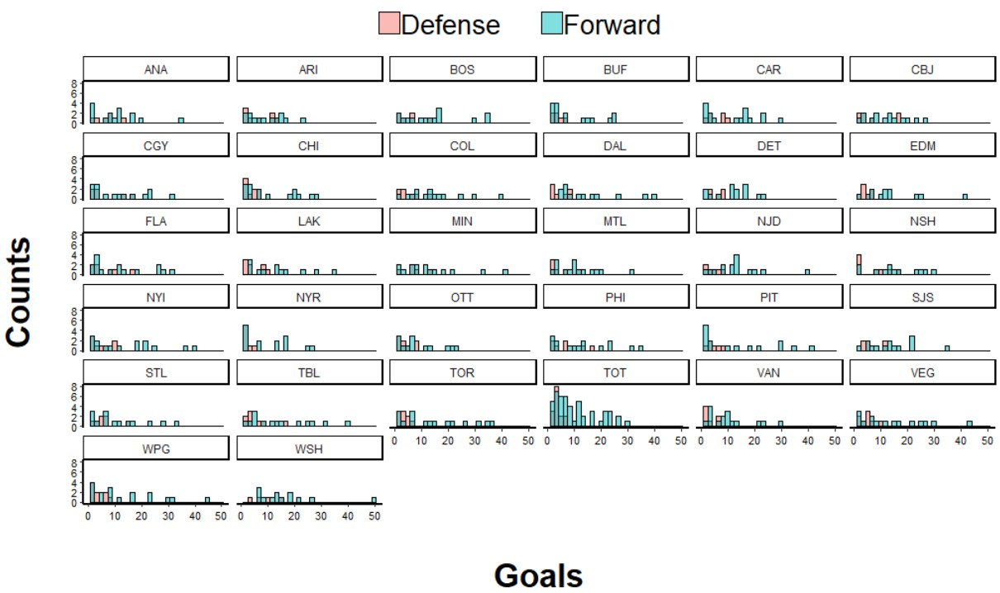
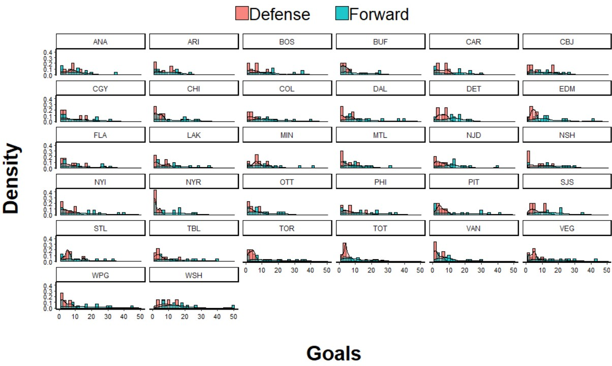

# Data Visualization Using R
# R_data_viz
This repository houses R scripts for data visualization. The point of these scripts is not to present meaningful data analyses, but simply to provide examples of common data visualization tools. All scripts are written in R, using tidyverse, ggplot2, and reshape2 libraries.

## Box Plots
### ggplot_boxplot.R
This script provides a simple example of a grouped box plot (goals scored by NHL players during the 2018 season, grouped by position). The tidy portion of the code also provides useful information on subsetting data based on column number and variable-specific filtering, changing column data types within a data.frame, and string location and replacement. 

The code also includes a call to geom_jitter(), also grouped by position, which plots individual data points over the boxplots. 

## Scatter Plots
### ggplot_scatterplot.R
This script provides simple examples of scatter plots (goals scored versus time on ice by NHL players). The tidy portion of the code also provides useful information on subsetting data based on column number and variable-specific filtering, changing column data types within a data.frame, and string location and replacement. 
The script has an example of an ungrouped scatter plot:

The code also includes an example of a grouped scatter plot (grouped by position): 

Finally, the code includes a call to geom_smooth(), which adds a best fit line:

## Histograms
### ggplot_histogram.R
This script provides simple examples of histograms (goals scored in a season, across multiple seasons). The tidy portion of the code also provides useful information on subsetting data based on column number and variable-specific filtering, changing column data types within a data.frame, and string location and replacement. 
The script has an example of an ungrouped histogram:

The code also includes an example of a grouped histogram (grouped by position, forward versus defense). Overlapping distributions can be shown as completely overlapping, dodged, or transparent: 

  

Finally, the code includes a call to geom_density(), which includes a density distribution:

## Heat Mapped Correlation Matrix
### ggplot_cormat.R
This script provides an example of a heat mapped correlation matrix (from a large NHL dataset). The tidy portion of the code also provides useful information on subsetting data based on column number and variable-specific filtering, changing column data types within a data.frame, string location and replacement, and generating a correlation matrix. 
The script has an example of a simple matrix:

The code also includes an example that plots the correlation coefficient in text over each correlation matrix position: 

## Facet Wrapping
### ggplot_facetwrap_histos.R
This script provides examples of facet wrapped histograms (distribution of goals within each NHL team during the 2018 season). The tidy portion of the code also provides useful information on subsetting data based on column number and variable-specific filtering, changing column data types within a data.frame, and string location and replacement. 
The script has an example of a simple facet wrap:

The code also includes examples with added complexity (grouping by a variable within each team and adding density): 

 

