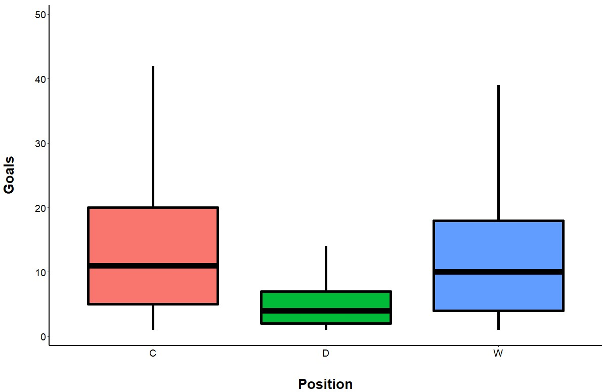
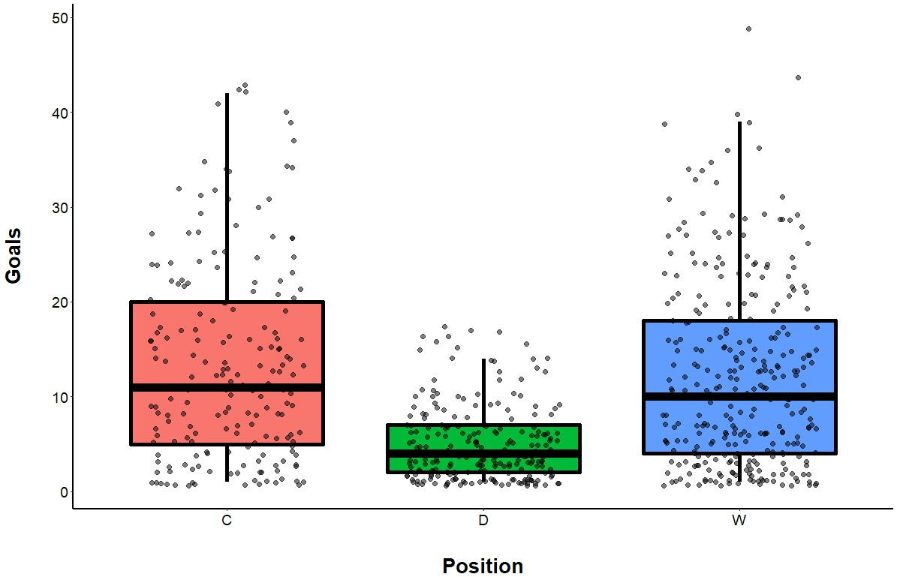
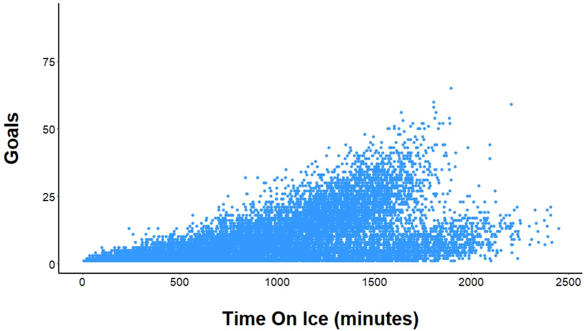
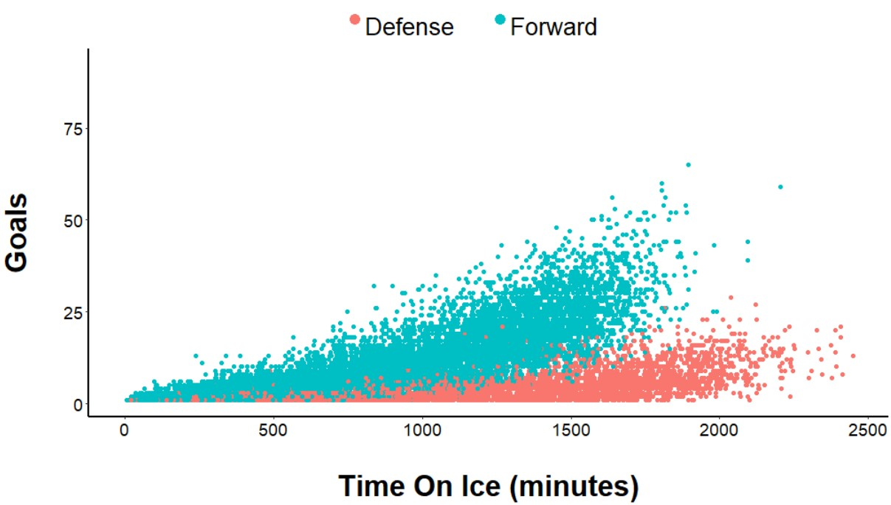
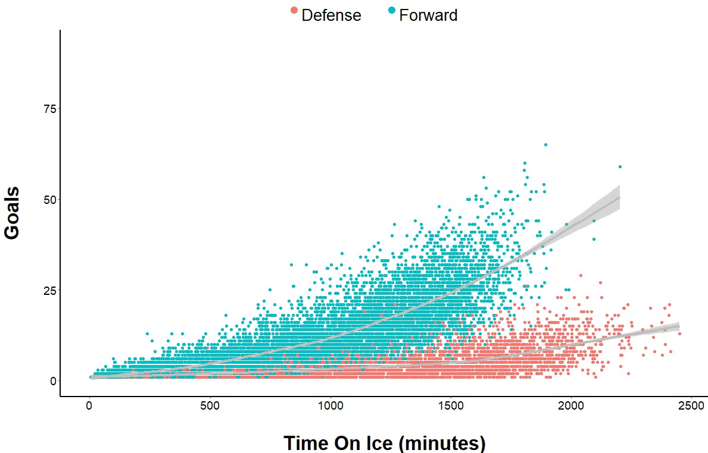
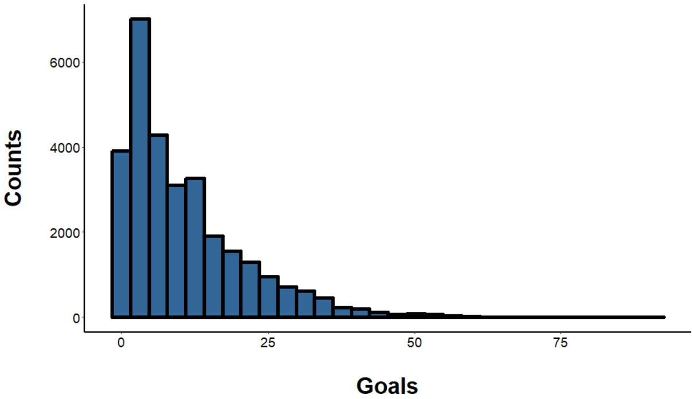
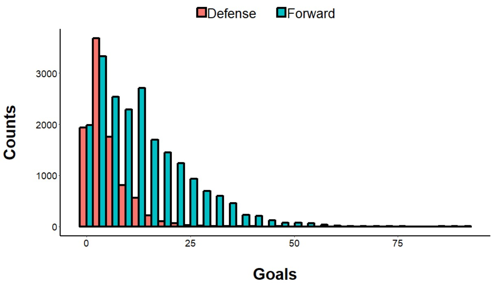
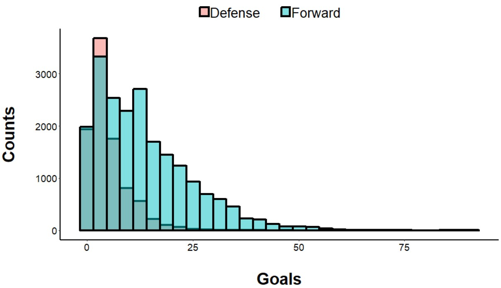
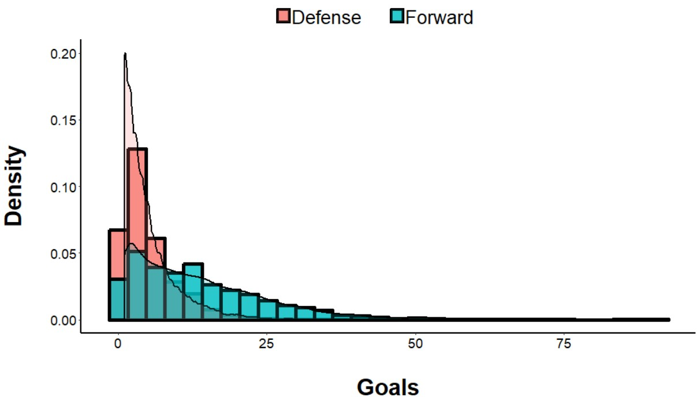

# Data Visualization Using R
# R_data_viz
This repository houses R scripts for data visualization

## Box Plots
### ggplot_boxplot.R
This file shows a simple example of a grouped box plot (goals scored by NHL players during the 2018 season, grouped by position). The tidy portion of the code also provides useful information on subsetting data based on column number and variable-specific filtering, changing column data types within a data.frame, and string location and replacement. 

The code also includes a call to geom_jitter(), also grouped by position, which plots individual data points over the boxplots. 

## Scatter Plots
### ggplot_scatterplot.R
This file shows a simple examples of scatter plots (goals scored versus time on ice by NHL players). The tidy portion of the code also provides useful information on subsetting data based on column number and variable-specific filtering, changing column data types within a data.frame, and string location and replacement. 
The script has an example of an ungrouped scatter plot:

The code also includes an example of a grouped scatter plot (grouped by position): 

Finally, the code includes a call to geom_smooth(), which adds a best fit line:

## Histograms
### ggplot_histogram.R
This file shows a simple examples of histograms (goals scored in a season, across multiple seasons). The tidy portion of the code also provides useful information on subsetting data based on column number and variable-specific filtering, changing column data types within a data.frame, and string location and replacement. 
The script has an example of an ungrouped histogram:

The code also includes an example of a grouped histogram (grouped by position, forward versus defense). Overlapping distributions can be shown as completely overlapping, dodged, or transparent: 

  

Finally, the code includes a call to geom_density(), which includes a density distribution:

## Heat Mapped Correlation Matrix

## Facet Wrapping

